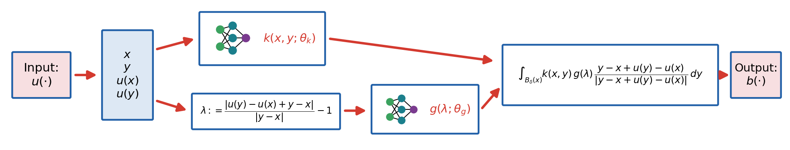
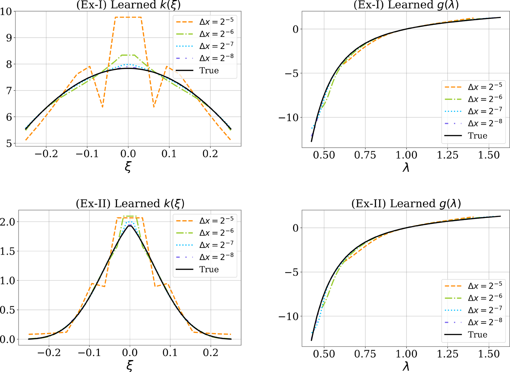
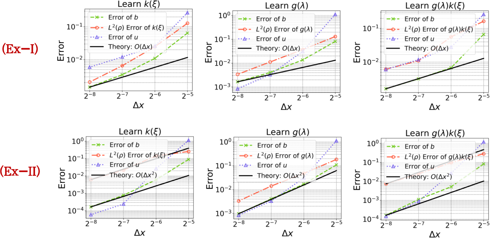
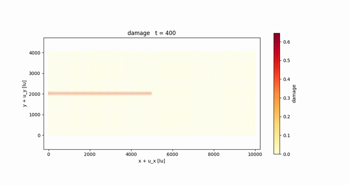
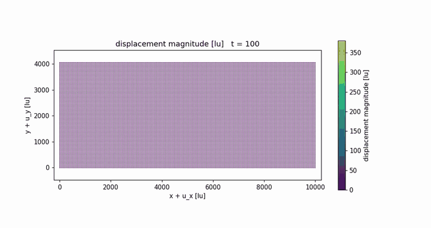
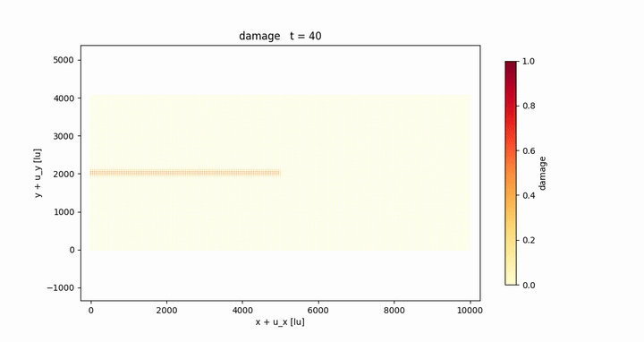
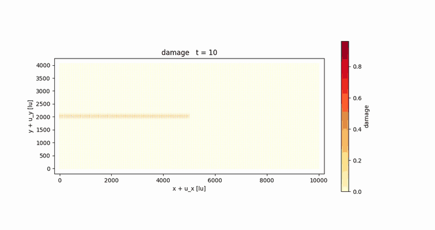

# PeridynamicNeuralOperator

Data-driven **nonlocal constitutive modeling** with peridynamic neural
operators: given displacement/loading field pairs, we learn a
bond-based peridynamic material model -- a nonlocal kernel `k` and a
nonlinear constitutive law `g` (plus a singularity exponent) -- that
can then be deployed in downstream simulations at resolutions, loading
scenarios, domain sizes, and length scales beyond the training data.



For each bond (x, y) the networks evaluate the kernel k(x, y; theta_k)
and the softening function g(lambda; theta_g) of the bond stretch
lambda; their product, integrated over the horizon B_delta(x), returns
the force density b. Both networks are trained end-to-end from
(u, b) field pairs.

This repository contains two subprojects:

| folder | model | paper |
| --- | --- | --- |
| [`Monotone PNO/`](Monotone%20PNO/) | **MPNO** -- monotone peridynamic neural operator with guaranteed solution uniqueness | CMAME **453** (2026) 118792 |
| [`Upscaling Fracture Mechanics/`](Upscaling%20Fracture%20Mechanics/) | **MNO** -- mesoscale neural operator learned from molecular dynamics, upscaled to fracture simulations | preprint (2026) |

---

## Monotone PNO (MPNO)

The MPNO learns a nonlocal kernel together with a nonlinear
constitutive relation while **guaranteeing well-posedness**: `g` is
parameterized by a monotone gradient network, whose architectural
constraint induces convexity of the learned energy density and hence
**uniqueness of solutions** in the small-deformation regime.

Highlights (from the paper):

- **Conditionally unique solutions** -- the monotone parameterization
  makes downstream boundary-value problems well-posed by construction,
  ruling out the non-physical solutions that unconstrained learned
  models can admit.
- **Convergence to the true model** -- on synthetic datasets with a
  manufactured kernel and constitutive law, the learned `g` and `k`
  are shown, both theoretically and numerically, to converge to the
  ground truth as the measurement grid is refined:

  

  

  *Top: learned k and g at grid sizes 2^-5 ... 2^-8 collapsing onto
  the true model.  Bottom: errors of the force field b, the learned
  model, and the downstream solution u vs. grid size, matching the
  theoretical O(dx) / O(dx^2) rates (Fig. 5 of the paper).*
- **Superior generalization** -- smaller displacement errors than
  conventional neural networks (MLP, ICNN) on out-of-distribution
  loadings in downstream solves.
- **Real-world expressivity** -- learns a homogenized model from
  coarse-grained molecular dynamics of a graphene-like sheet, with
  physically interpretable `g` and `k`.

Validated on analytical 1D/2D Blatz--Ko datasets and coarse-grained MD
data; see [`Monotone PNO/README.md`](Monotone%20PNO/README.md) for the
experiment-by-experiment layout.

**Environment and running.** Python 3.10, CUDA 11.x:

```bash
cd "Monotone PNO"
pip install -r requirements.txt
# generate a dataset, then run a per-experiment driver, e.g.:
cd BlatzKo_1d/1d_nonlocal_BlatzKo_analytical_data && python3 BlatzKo_1d_analytical_u_ex37.py
cd ../PNO_MGN_ex37_k1k2_cMGN && python3 PNO_BB.py
```

---

## Mesoscale Neural Operator (MNO): upscaling fracture mechanics

The MNO extends the framework to **fracture**, learned directly from
coarse-grained molecular dynamics (Angstrom scale) and deployed at
scales up to ~100x larger.  The key ingredient is the intrinsic length
scale (horizon delta) and a delta-normalized formulation that keeps
the **energy density and energy release rate consistent across
scales**, together with a rescaling law for the critical stretch.

Highlights (from the preprint):

- **Scale-consistent constitutive law** -- the delta-normalization
  guarantees invariant strain energy density and energy release rate
  under horizon rescaling, enabling downstream simulations ~10x-100x
  larger than the training scale.
- **Learned from MD, validated on energies** -- trained on
  quasi-static coarse-grained MD (~1e-10 m); the learned model
  reproduces the MD strain energy density and energy release rate to
  < 5% error.
- **Validated on total forces** -- in quasistatic pull tests the
  learned model matches the measured MD force curve to 3.8% relative
  L2 without fracture, and reproduces the pre-notched failure peaks to
  within 2% at two domain sizes (583 vs 572 fu at 100x200; 923 vs 928
  fu at 200x400) with matching brittle collapse:

  

  

- **Downstream crack branching** -- implicit dynamic fracture of a
  1 um pre-notched plate (10x the trained horizon).  As the applied
  load grows, the learned model reproduces the classic brittle-fracture
  morphology transition: a straight running crack at T = 1000 fu, a
  clean symmetric bifurcation at T = 10000 fu, and cascading
  multi-branching at T = 20000 fu (damage fields on the deformed
  configuration):

  **T = 1000 fu -- straight crack and full separation:**

  

  

  **T = 10000 fu -- crack branching:**

  

  **T = 20000 fu -- cascading multi-branching:**

  

  Full-resolution movies (damage and displacement for each load):
  [T=1000](Upscaling%20Fracture%20Mechanics/downstream%20on%20crack%20branching/traction1000_damage.mov)
  ([disp](Upscaling%20Fracture%20Mechanics/downstream%20on%20crack%20branching/traction1000_displacement.mov)),
  [T=10000](Upscaling%20Fracture%20Mechanics/downstream%20on%20crack%20branching/traction10000_damage.mov)
  ([disp](Upscaling%20Fracture%20Mechanics/downstream%20on%20crack%20branching/traction10000_displacement.mov)),
  [T=20000](Upscaling%20Fracture%20Mechanics/downstream%20on%20crack%20branching/traction20000_damage.mov)
  ([disp](Upscaling%20Fracture%20Mechanics/downstream%20on%20crack%20branching/traction20000_displacement.mov)).

**Environment and running.** Python 3.10 with PyTorch 2.5.1, NumPy
2.0.1, SciPy 1.15.2, PyTorch Geometric 2.7.0 (plus Matplotlib and
scikit-learn).  Quick start from
[`Upscaling Fracture Mechanics/`](Upscaling%20Fracture%20Mechanics/):

```bash
cd training && python3 MD_code/train.py --smoke-test   # training pipeline
cd validation && python plot_lr3e4_summary.py          # MD comparisons
```

Full training, validation, and downstream commands (with all
parameters explained) are in
[`Upscaling Fracture Mechanics/README.md`](Upscaling%20Fracture%20Mechanics/README.md).

---

## Citations

**MPNO** (published):

```bibtex
@article{wang2026monotone,
  title   = {Monotone peridynamic neural operator for nonlinear material
             modeling with conditionally unique solutions},
  author  = {Wang, Jihong and Tian, Xiaochuan and Zhang, Zhongqiang and
             Silling, Stewart and Jafarzadeh, Siavash and Yu, Yue},
  journal = {Computer Methods in Applied Mechanics and Engineering},
  volume  = {453},
  pages   = {118792},
  year    = {2026},
  doi     = {10.1016/j.cma.2026.118792}
}
```

**MNO** (preprint):

```bibtex
@article{yu2026mesoscale,
  title  = {Mesoscale Neural Operators: Learning Nonlinear Constitutive
            Laws from Molecular Dynamics for Scalable Fracture
            Prediction},
  author = {Yu, Yue and Wang, Jihong and Silling, Stewart and Yang, Ziwei},
  note   = {Preprint},
  year   = {2026}
}
```
